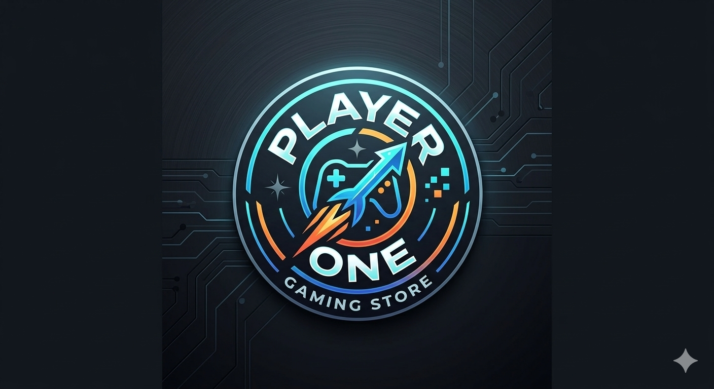

<!--1. Título principal +  descrição -->

# Player One
A Player One é uma loja online especializada na venda de videojogos, jogos de tabuleiro e acessórios para todo o tipo de jogadores. 
O nosso objetivo é aproximar as pessoas através do entretenimento, oferecendo as últimas novidades do mercado e clássicos inesquecíveis. 
Aqui encontra tudo o que precisa para elevar a sua experiência de jogo para o próximo nível.

<!--2. e 3. 3 Título de nível 2 e um título de nível 3 -->
## ## 🛠️ Tecnologias
Para o desenvolvimento desta plataforma, escolhemos tecnologias web robustas e modernas. O ecossistema assenta na separação clara entre a estrutura de dados, o design visual focado na experiência do utilizador (*UX*) e a programação lógica que controla as ações da loja.


## 📦 Instalação
### Passos para executar o projecto
O processo de execução foi desenhado para ser o mais simples possível, permitindo que qualquer programador coloque a loja online a funcionar em menos de cinco minutos. Recomendamos a utilização do servidor local integrado do **VS Code** (como a extensão *Live Server*) para garantir que todos os caminhos de ficheiros e imagens abrem corretamente sem falhas de carregamento.

## 🎮 Categoria de Jogos
O nosso catálogo foi estruturado meticulosamente para abranger todas as faixas etárias e preferências de entretenimento. Dividimos a loja em secções digitais e analógicas, garantindo que tanto os entusiastas de consolas de última geração como os amantes de serões clássicos em família encontram o produto ideal para os seus momentos de lazer.


<!-- 4.Tabela -->
Tabela
| Tecnologia | Versão | Tipo |
| :--- | :---: | :---: |
| HTML5 | 5.0 | Estrutura |
| CSS3 | 3.0 | Estilização |
| Javascript | ES6 | Lógica | 

<!-- 5. Lista não ordenada -->
### 🛍️ O que vendemos na loja:
* Videojogos (Consolas e PC)
* Jogos de Tabuleiro modernos
* Jogos de Cartas colecionáveis (TCG)
* Acessórios e Merchandising

<!-- 6. Lista ordenada -->
### 📝 Tarefas de organização da loja:
- [x] Registar stock de jogos de tabuleiro
- [x] Atualizar preços dos videojogos
- [ ] Adicionar categoria de jogos de cartas

1. Descarregue a pasta do projeto para o seu computador.
2. Abra a pasta no seu editor de código favorito (ex: VS Code).
3. Procure e verifique as definições no ficheiro config.txt.
4. Abra o ficheiro index.html no navegador para testar a loja.

<!-- 7. Código SQL-->
### 💾 Configuração da Base de Dados

Para criar a tabela de jogos no seu sistema, execute o seguinte comando SQL:

```sql
CREATE TABLE jogos (
    id INT PRIMARY KEY,
    nome VARCHAR(100),
    preco DECIMAL(5,2),
    categoria VARCHAR(50)
);
```
<!-- 8. Código em linha -->
1. Procure e verifique as definições no ficheiro ⚙️ `config.txt`.
2. Abra o ficheiro 🌐 `index.html` no navegador para testar a loja.

<!-- 9. Link -->
## ✍️ Autores
Este projeto foi desenvolvido por mim. Pode visitar o meu perfil através do [Link para o GitHub](https://github.com).


<!-- 10. Negrito e itálico -->
> ⚠️ **Aviso Importante:** Este projeto é *estritamente* para fins educativos e simulação de uma loja online.
